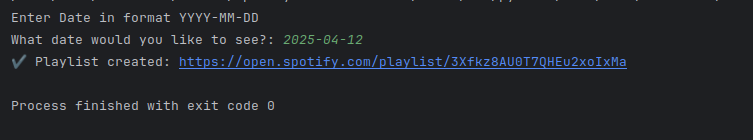
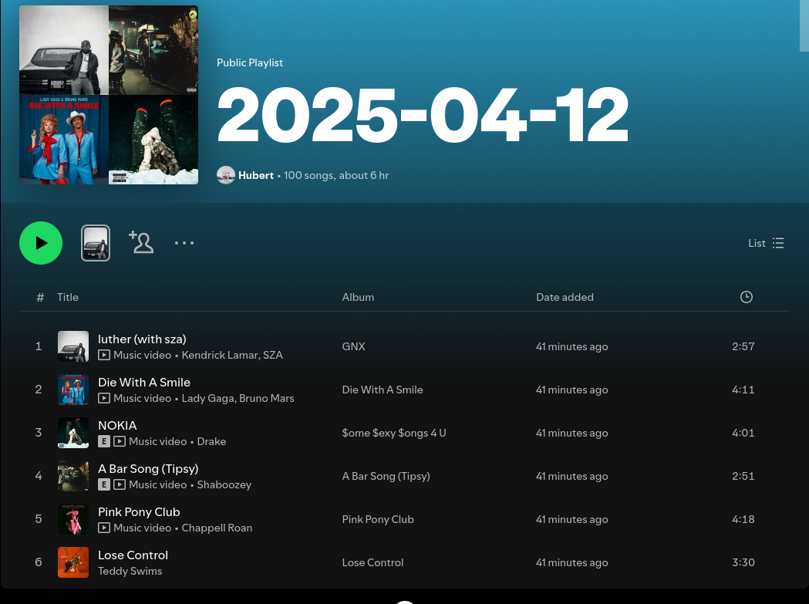

# Spotify-Platlist-Maker-Top100-Songs
 <h2>Creates playlists with top 100 songs from entered date, webscarping / Spotify API.
 Scraping data of 100 most played songs from <a href="https://www.billboard.com/charts/hot-100/">Billboard</a></h2>

<h3> modules used: 
-spotipy (authentication, adding tracks, creating playlists) 
-requests 
-Beautifulsoup 4</h3>

<h2>How to use: </h2>
<h3>enter spotify for developers (https://developer.spotify.com/dashboard) log in, create an app 
and in APIs select "WEB API", redirect uri can be: http://127.0.0.1:9090  
Then in folder keys create: 
client_id.txt (paste client id from app dashboard) 
client_secret.txt (paste client secret from app dashboard) 
redirect_uri.txt (paste redirect uri from dashboard) 
Afer launching the app it will ask for a date and then fetch list of tracks from website,  
then it will create playlist on your profile and add them one by one. 
</h3><h2>
Input: 
 
Result: 

</h2>
